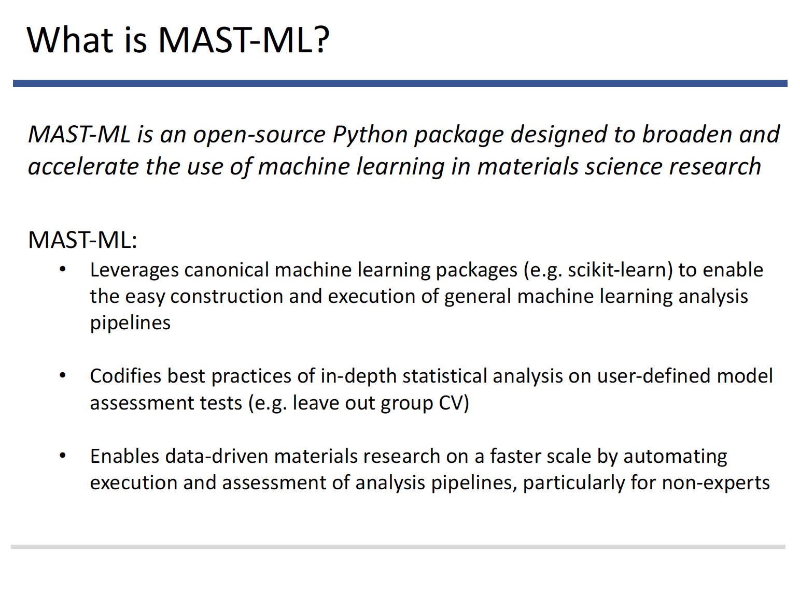
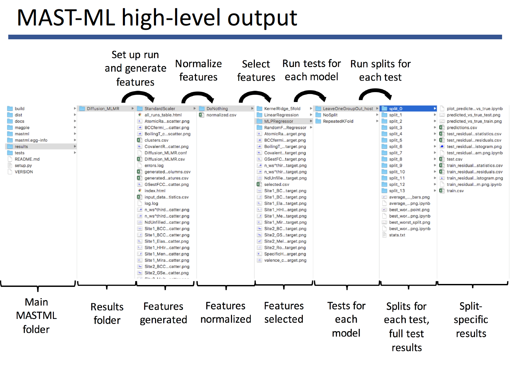
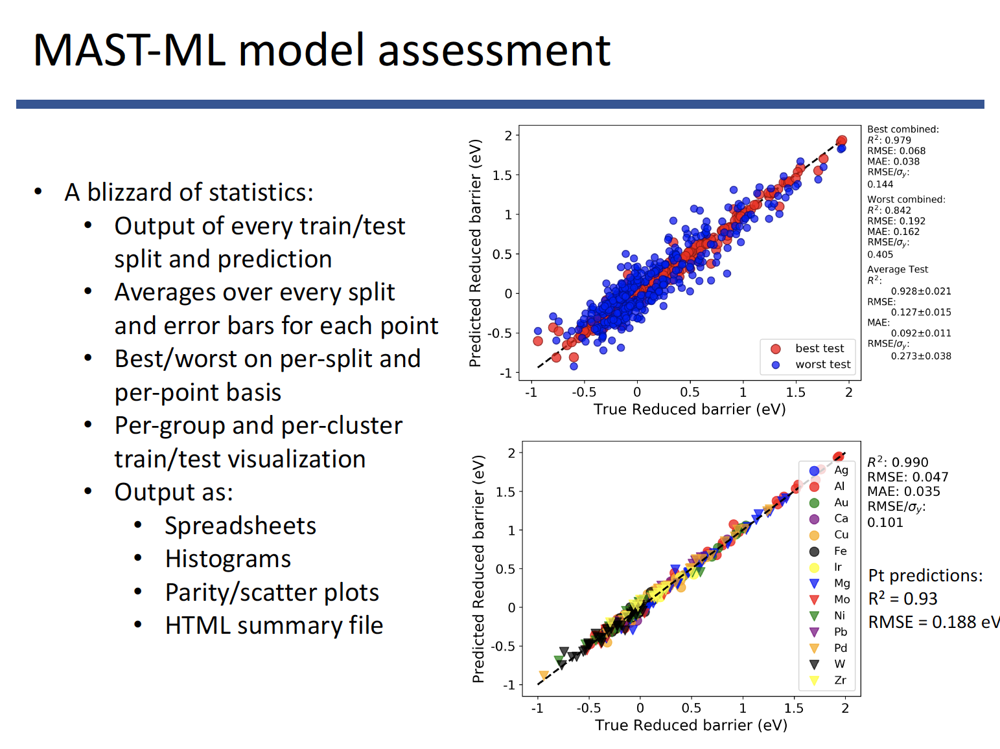

******************************************************************
MAST-ML overview slides
******************************************************************

The information for this MAST-ML overview shown on this page is available for download here:

:download:`MASTMLoverview <MASTMLtutorial.pdf>`

Let's begin with an overview of what MAST-ML is and what it can do:

Here is currently what MAST-ML can do as well as how to acquire it:

.. image:: MASTMLscope.png

An overview of the general machine learning workflow that MAST-ML executes. Continuing development will focus on making the workflows more flexible and general

.. image:: MASTMLworkflow.png

MAST-ML uses a text-based input file (.conf extension) which consists of different sections (corresponding to each part of the workflow) and specific subsections (e.g. different machine learning models to test, different feature selection algorithms, etc.). The input file is discussed in much greater detail here:

:ref:`mastml_input_file`

and an input file with the full range of capabilities can be downloaded here:

:download:`MASTMLinputfile <MASTML_fullinputfile.conf>`

.. image:: MASTMLsampleinput.png

Running MAST-ML is easily done with a single-line command in a Terminal/command line, your favorite IDE, or within a Jupyter notebook

.. image:: RunningMASTML.png

MAST-ML output takes the form of a full directory tree of results, with each level of the tree corresponding to a different portion of the machine learning workflow

The last three figures demonstrate some example output of a few machine learning analysis features MAST-ML offers. Here, the ability to generate and select features is shown.

.. image:: MASTMLfeaturegenerationselection.png

A core feature of MAST-ML is the many pieces of statistical analysis regarding model assessment, which forms the basis of interpreting the quality and extensibility of a machine learning model.

Finally, MAST-ML offers the ability to easily optimize the model hyperparameters used in your analysis

.. image:: MASTMLhyperparameter.png