******************************************************************
MAST-ML tutorial
******************************************************************

==================
Introduction
==================

This document provides step-by-step tutorials of conducting and analyzing different MAST-ML runs. For this tutorial,
we will be using the dataset example_data.csv in the tests/csv/ folder and input file example_input.conf in tests/conf/.

MAST-ML requires two files to run: The first is the text-based input file (.conf extension). This file contains all of
the key settings for MAST-ML, for example, which models to fit and how to normalize your input feature matrix. The
second file is the data file (.csv or .xlsx extension). This is the data file containing the input feature columns and
values (X values) and the corresponding y data to fit models to. The data file may contain other columns that are
dedicated to constructing groups of data for specific tests, or miscellaneous notes, which columns can be selectively
left out so they are not used in the fitting. This will be discussed in more detail below.

Throughout this tutorial, we will be modifying the input file to add and remove different sections and values. For a
complete and more in-depth discussion of the input file and its myriad settings, the reader is directed to the dedicated
input file section:

:ref:`mastml_input_file`

The data contained in the example_data.csv file consist of a previously selected matrix of X features created from
combinations of elemental properties, for example the average atomic radius of the elements in the material. The y data
values used for fitting are listed in the "Reduced barrier (eV)" column, and are DFT-calculated migration barriers of
dilute solute diffusion, referenced to the host system. For example, the value of Ag solute diffusing through a Ag host
is set to zero. The "Host element" and "Solute element" columns denote which species comprise the corresponding reduced
migration barrier.

======================
Your first MAST-ML run
======================

It's time to conduct your very first MAST-ML run! First, we will set up the most basic input file, which will only
import your data and input file, and do nothing else except copy the input files to the results directory and output a
basic histogram of the target data. Open the example_input.conf file (or create your own new file), and write the following
in your input file:

Example::

    [GeneralSetup]
        input_features = Auto
        target_feature = Reduced barrier (eV)
        randomizer = False
        metrics = Auto
        not_input_features = Host element, Solute element, predict_Pt

The General Setup section contains high-level control about how your input data file is parsed. Additional details of
each parameter can be found in the MAST-ML Input File section in this documentation. Briefly, setting "input_features" to
"Auto" will automatically assign all columns to be part of the X feature matrix, except those that are associated with
target_feature or not_input_features. The option "randomizer" will shuffle all of your y-data, which can be useful for
running a "null" test. The "metrics" option is used to denote which metrics to eventually evaluate your models on, such
as mean_absolute_error. Using "Auto" provides a catalogue of standard metrics which is generally sufficient for many
problems. Finally, the "not_input_features" field is used to denote any feature columns you don't want to use in fitting.
If some columns contain text notes, these will need to be added here too.

There are two ways to execute a MAST-ML run. The first is to run it via a Terminal or IDE command line by directly calling
the main MAST-ML driver module. Here, the python -m (for module) command is invoked on the mastml.masml_driver module, and
the paths containing the input file and data file are passed in. Lastly, the argument -o (for output) is used together
with the path to put all results files and folders.

Example::

    python3 -m mastml.mastml_driver tests/conf/example_input.conf tests/csv/example_data.csv -o results/mastml_tutorial

The second way is to run MAST-ML through a Jupyter notebook by importing mastml and running the mastml_driver main()
method and supply the paths to the input file, data file

Example::

    import mastml_driver
    conf_path = 'tests/conf/example_input.conf'
    data_path = 'tests/conf/example_data.csv'
    results_path = 'results/mastml_tutorial'
    mastml_driver.main(conf_path, data_path, results_path)

Let's examine the output from this first run. Below is a screenshot of a Mac directory output tree in the results/mastml_tutorial
folder. Note that you can re-use the same output folder name, and the date and time of the run will be appended so no
work will be lost. Each level of the directory tree corresponds to a step in the general supervised learning workflow that
MAST-ML uses. The first level is general data input and feature generation, the second level is numerical manipulation
of features, and the third level is selection of features. Since we did not do any feature manipulation in this run, the
output selected.csv, normalized.csv and generated_features.csv are all the same, and are the same file as the copied
input data file, example_data.csv. In the main directory tree, there is also a log.log and errors.log file, which summarize
the inner details of the MAST-ML run and flag any errors that may have occurred. There are two .html files which provide
very high-level summaries of data plots and file links that may be of interest, to make searching for these files easier.
Finally, there is some generated data about the statistics of your input target data. A histogram named target_histogram.png
is created, and basic statistical summary of your data is saved in the input_data_statistics.csv file.

.. image:: MASTMLtutorial_run1.png

===================
Cleaning input data
===================

Now, let's imagine a slightly more complicated (but realistic) scenario where some of the value of your X feature matrix
are not known. Open your example_data.csv file, and randomly remove some values of the X feature columns in your dataset.
Don't remove any y data values in the "Reduced Barrier (eV)" column. You'll need to add the following section to your
input file to handle cleaning of the input data:

Example::

    [DataCleaning]
        cleaning_method = imputation
        imputation_strategy = mean

What this does is perform data imputation, where each missing value will be replaced with the mean value for that particular
feature column. Other data cleaning options include imputation with median values, simply removing rows of data with
missing values, or performing a probabilistic principal component analysis to fill in missing values.

From inspecting the data file in the parent directory to that in the subsequent directories, you can see that the missing
values (here, the first 10 rows of the first several features were removed) have been replaced with the mean values for
each respective feature column:

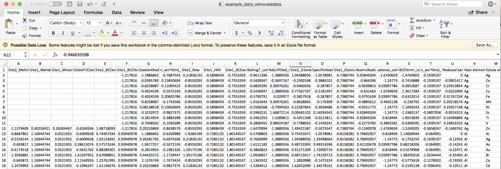

After data cleaning with imputation:

.. image:: MASTMLtutorial_run2_2.png

====================================
Feature generation and normalization
====================================

For this run, we are going to first generate a large X feature matrix based on a suite of elemental properties. Then,
we are going to normalize the feature matrix so that all values in a given feature column have a mean of zero and a
standard deviation equal to one.

To perform the feature generation and normalization steps, add these sections to your input file. Use the same file from
the previous run, which contains the GeneralSetup and DataCleaning sections, and use your data file with the values you
previously removed. (Note that you can use the pristine original data file too, and the data cleaning step will simply
do nothing). For the purpose of this example, we are going to generate elemental features using the MAGPIE approach,
using compositions as specified in the "Solute element" column of the data file. Note that if multiple elements are
present, features containing the average (both mean and composition-weighted averages) of the elements present will be
calculated. The value specified in the composition_feature parameter must be a column name in your data file which
contains the material compositions.

Example::

    [FeatureGeneration]
        [[Magpie]]
            composition_feature = Solute element

    [FeatureNormalization]
        [[StandardScaler]]

After performing this run, we can see that the .csv files in the feature generation and normalization folders of the
results directory tree are now updated to reflect the generated and normalized X feature matrices. There are now many
more features in the generated_features.csv file:

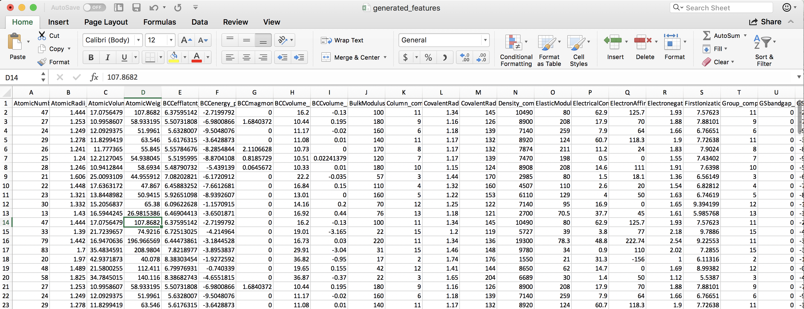

Note that feature columns that are identical in all values are removed automatically. We can see that the normalized
feature set consists of each column having mean zero and standard deviation of one:

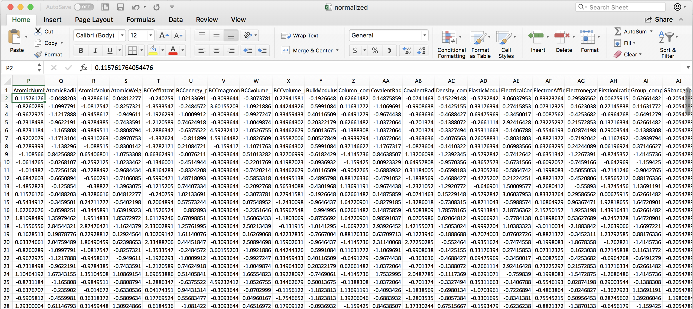

========================================
Training and evaluating your first model
========================================

Now that we have a full X feature matrix that has been normalized appropriately, it is time to train and evaluate your
first model. For this tutorial, we will train a Kernel Ridge model with a radial basis function kernel (also known as
Gaussian Kernel Ridge Regression, GKRR). We need to add two sections of our input file.

The first is the Models section, which provides a list of model types to train and the associated parameter values for
each model. Here, we have chosen values of alpha and gamma equal to 1. There is no reason to think that these are the
optimal parameter values, they were simply chosen as an example. Later in this tutorial we will optimize these
parameters. Note that if you don't specify the model parameter values, the values used will be the scikit-learn default values.

The second is the DataSplits section, which controls what types of fits and cross-validation tests will be applied to
each specified model. Here, we have chosen "NoSplit", which is simply a full y versus X fit of the data, without any
form of cross-validation. We have also denoted "RepeatedKFold", which is random leave-out cross-validation test. In this
instance, we have 5 splits (so leave out 20%) and do the test two times.

Example::

    [Models]
        [[KernelRidge]]
            kernel = rbf
            alpha = 1
            gamma = 1

    [DataSplits]
        [[NoSplit]]
        [[RepeatedKFold]]
            n_splits = 5
            n_repeats = 2

Below is a snapshot of the resulting directory tree generated from this MAST-ML run. You'll immediately notice the tree
is deeper now, with a new level corresponding to each model we've fit (here just the single KernelRidge model), and, for
each model, folders corresponding to each DataSplit test we denoted in the input file. For each data split method, there
are folders and corresponding data plots and files for each hold-out split of the test. For instance, with the
RepeatedKFold test, there were 10 total splits, which are labeled as split_0 through split_9. Contained in each folder
are numerous files, such as different data parity plots of predicted vs. actual values, histograms of residuals, .csv
files for all plotted data, a .pkl file of the exported trained model, and .ipynb Jupyter notebooks useful for custom
modifications of the data plots.

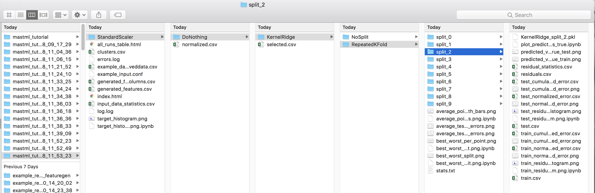

Below is a parity plot from the NoSplit (full data fit) run. The R-squared value is high, but there is significant mean
error. This suggests that the model parameters are not optimal (which shouldn't be surprising considering we just picked
them arbitrarily).

.. image:: MASTMLtutorial_run4_2.png

From examining the parity plot from the RepeatedKFold run (this is the 'average_points_with_bars.png' plot), which has
the averaged values over all 10 splits, we can see that the predictions from random cross validation result in both a very
low R-squared value and a high error. Essentially, cross-validation has shown that this model has no predictive ability.
It seems our issues are two-fold: nonoptimal hyperparameters, and over-fitting. The over-fitting is evident due to the much
worse before of the cross-validated parity plot compared to the full fit.

.. image:: MASTMLtutorial_run4_3.png

========================================
Feature selection and learning curves
========================================

As mentioned above, one problem with our current model is over-fitting. To further understand and minimize the effect of
over-fitting, it is often necessary to construct learning curves and perform feature selection to obtain a reduced feature
set which most accurately describes your data. To do this, we are going to add two additional sections to our input file.

The first section is related to feature selection. Here, we will use the SequentialFeatureSelector algorithm, which
performs forward selection of features. We will select a total of 20 features, and use a KernelRidge model to evaluate
the selected features. Here, we ahve denoted our estimator as "KernelRidge_select". The models used in feature selection
and learning curves are removed from the model queue, because in general one may want to use a different model for this
step of the analysis than what will ultimately be used for fitting. Therefore, we need to also amend our models list to
have this new KernelRidge_select model, as shown below.

Example::

    [FeatureSelection]
        [[SequentialFeatureSelector]]
            estimator = KernelRidge_select
            k_features = 20

    [Models]
        [[KernelRidge]]
            kernel = rbf
            alpha = 1
            gamma = 1
        [[KernelRidge_select]]
            kernel = rbf
            alpha = 1
            gamma = 1

The second section we will add is to plot learning curves. There are two types of learning curves MAST-ML can make: a
data learning curve and feature learning curve. The former is a plot of the metric of interest versus the amount of
training data used in the fits. The latter is a plot of the metric of interest versus the number of features comprising
the X feature matrix. In the example LearningCurve input file section shown below, we are going to use a KernelRidge
model, a random k-fold cross-validation and the root_mean_square_error to evaluate our learning curves. We will also
use a maximum of 20 features, and use the SelectKBest algorithm to assess the choice of features.

Example::

    [LearningCurve]
        estimator = KernelRidge_learn
        cv = RepeatedKFold_learn
        scoring = root_mean_squared_error
        n_features_to_select = 20
        selector_name = SelectKBest

As with the above example of FeatureSelection, we need to add the KernelRidge_learn and RepeatedKFold_learn entries to
the Models and DataSplits sections of our input file, respectively. At this point in the tutorial, the complete input
file should look like this:

Example::

    [GeneralSetup]
        input_features = Auto
        target_feature = Reduced barrier (eV)
        randomizer = False
        metrics = Auto
        not_input_features = Host element, Solute element, predict_Pt

    [DataCleaning]
        cleaning_method = imputation
        imputation_strategy = mean

    [FeatureGeneration]
        [[Magpie]]
            composition_feature = Solute element

    [FeatureNormalization]
        [[StandardScaler]]

    [FeatureSelection]
        [[SequentialFeatureSelector]]
            estimator = KernelRidge_select
            k_features = 20

    [LearningCurve]
        estimator = KernelRidge_learn
        cv = RepeatedKFold_learn
        scoring = root_mean_squared_error
        n_features_to_select = 20
        selector_name = SelectKBest

    [Models]
        [[KernelRidge]]
            kernel = rbf
            alpha = 1
            gamma = 1
        [[KernelRidge_select]]
            kernel = rbf
            alpha = 1
            gamma = 1
        [[KernelRidge_learn]]
            kernel = rbf
            alpha = 1
            gamma = 1

    [DataSplits]
        [[NoSplit]]
        [[RepeatedKFold]]
            n_splits = 5
            n_repeats = 2
        [[RepeatedKFold_learn]]
            n_splits = 5
            n_repeats = 2

Let's take a look at the same full fit and RepeatedKFold random cross-validation tests for this run:

Full-fit:

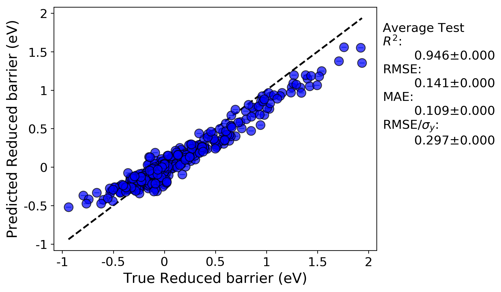

Random leave out cross-validation:

.. image:: MASTMLtutorial_run5_2.png

What we can see is, now that we down-selected features from more than 300 features in the previous run to just 20 here,
that the fits have noticeably improved and the problem of over-fitting has been minimized. Below, we can look at the
plotted learning curves

Data learning curve:

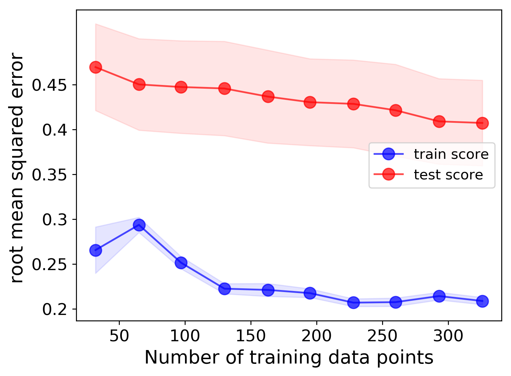

Feature learning curve:

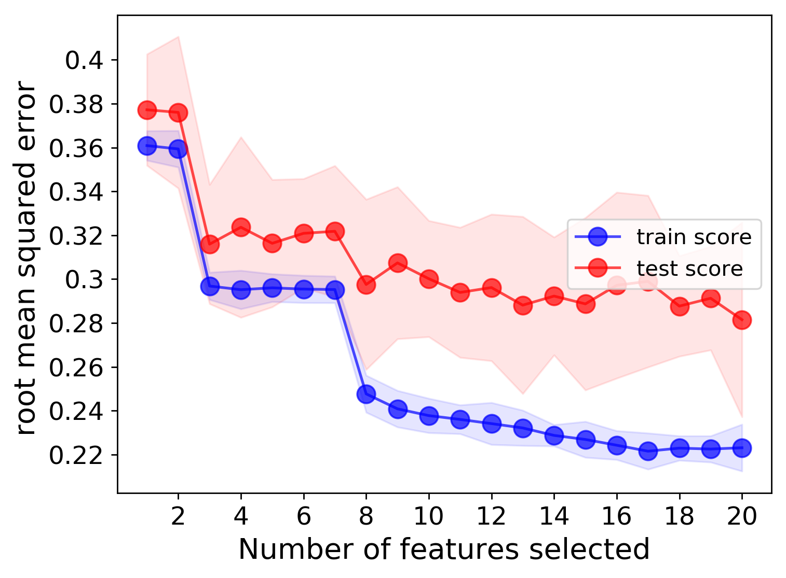

We can clearly see that, as expected, having more training data will result in better test scores, and adding more features
(up to a certain point) will also result in better fits. Based on these learning curves, one may be able to argue that
additional features should could be used to further lower the error.

========================================
Hyperparameter optimization
========================================

Next, we will consider optimization of the model hyperparameters, in order to use a better optimized model with a
selected feature set to minimize the model errors. To do this, we need to add the HyperOpt section to our input file,
as shown below. Here, we are optimzing our KernelRidge model, specifically its root_mean_squared_error, by using our
RepeatedKFold random leave-out cross-validation scheme. The param_names field provides the parameter names to optimize.
Here, we are optimizing the KernelRidge alpha and gamma parameters. Parameters must be delineated with a semicolon. The
param_values field provides a bound on the values to search over. Here, the minimum value is -5, max is 5, 100 points are
analyzed, and the numerical scaling is logarithmic, meaning it ranges from 10^-5 to 10^5. If "lin" instead of "log" would
have been specified, the scale would be linear with 100 values ranging from -5 to 5.

Example::

    [HyperOpt]
        [[GridSearch]]
            estimator = KernelRidge
            cv = RepeatedKFold
            param_names = alpha ; gamma
            param_values = -5 5 100 log ; -5 5 100 log
            scoring = root_mean_squared_error

Let's take a final look at the same full fit and RepeatedKFold random cross-validation tests for this run:

Full-fit:

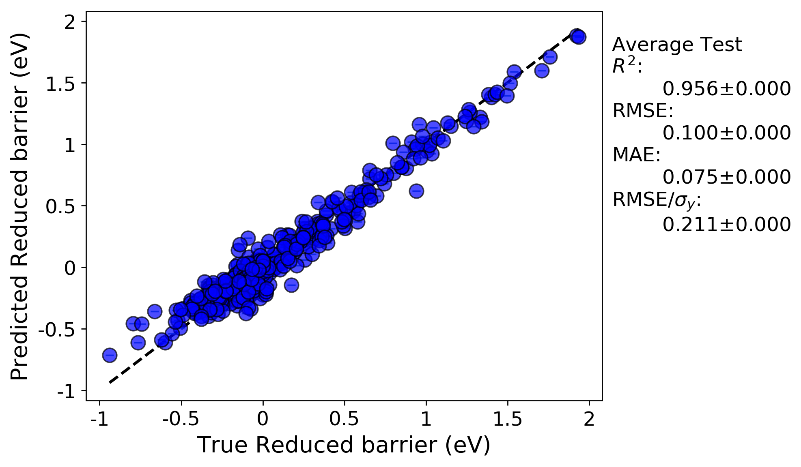

Random leave out cross-validation:

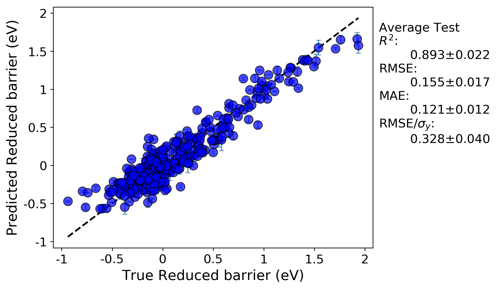

What we can see is, now that we down-selected features from more than 300 features in the previous run to just 20, along
with optimizing the hyperparameters of our KernelRidge model, our fits are once again improved. The hyperparameter
optimization portion of this workflow outputs the hyperparameter values and cross-validation scores for each step of,
in this case, the GridSearch that we performed. All of this information is saved in the KerenlRidge.csv file in the
GridSearch folder in the results directory tree. For this run, the optimal hyperparameters were alpha = 0.034 and gamma = 0.138

========================================================
Random leave-out versus leave-out-group cross-validation
========================================================

Here, we will use our selected feature set and optimized KernelRidge hyperparameters from the previous section to do a
new kind of cross-validation test: leave out group (LOG) CV. To do this, you will modify the alpha and gamma values in the
Models section, KernelRidge model in your input file. In addition, you can rename the selected.csv data file to a
new name, for example "example_data_selected.csv", and use the path to this new data file for this new run, as we
will not be performing feature selection again (to save time).

We will compare these results to the results of LOG cross-validation with the random cross-validation. Our input data file
had a column called "Host element". This is a natural grouping to use for this problem, as it is interesting to assess our
fits when training on a set of host elements and predicted the values of an entirely new host element set, without having
ever trained on that set. Modify your input file to match what is shown below. Note that we have commented out the sections
that we no longer want with the # symbol. You can either comment out the sections or remove them entirely.

Example::

    [GeneralSetup]
        input_features = Auto
        target_feature = Reduced barrier (eV)
        randomizer = False
        metrics = Auto
        not_input_features = Host element, Solute element, predict_Pt
        grouping_feature = Host element

    #[DataCleaning]
    #    cleaning_method = imputation
    #    imputation_strategy = mean

    #[FeatureGeneration]
    #    [[Magpie]]
    #        composition_feature = Solute element

    [FeatureNormalization]
        [[StandardScaler]]

    #[FeatureSelection]
    #    [[SequentialFeatureSelector]]
    #        estimator = KernelRidge_select
    #        k_features = 20

    #[LearningCurve]
    #    estimator = KernelRidge_learn
    #    cv = RepeatedKFold_learn
    #    scoring = root_mean_squared_error
    #    n_features_to_select = 20
    #    selector_name = SelectKBest

    [Models]
        [[KernelRidge]]
            kernel = rbf
            alpha = 0.034
            gamma = 0.138
        #[[KernelRidge_select]]
        #    kernel = rbf
        #    alpha = 1
        #    gamma = 1
        #[[KernelRidge_learn]]
        #    kernel = rbf
        #    alpha = 1
        #    gamma = 1

    [DataSplits]
        [[NoSplit]]
        [[RepeatedKFold]]
            n_splits = 5
            n_repeats = 2
        #[[RepeatedKFold_learn]]
        #    n_splits = 5
        #    n_repeats = 2
        [[LeaveOneGroupOut]]
            grouping_column = Host element

    #[HyperOpt]
    #    [[GridSearch]]
    #        estimator = KernelRidge
    #        cv = RepeatedKFold
    #        param_names = alpha ; gamma
    #        param_values = -5 5 100 log ; -5 5 100 log
    #        scoring = root_mean_squared_error

The main new additions to this input file is under the General Setup section, where the parameter grouping_feature needs
to be added, and the addition of LeaveOutGroup to the DataSplits section.

By doing this run, we can assess the model fits resulting from the random cross-validation and the LOG cross-validation.

Random cross-validation:

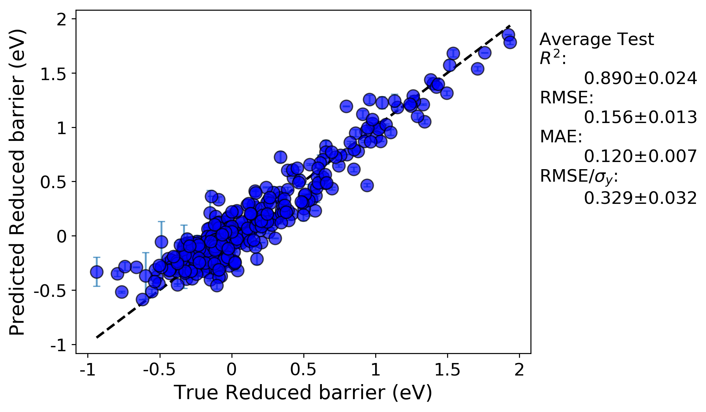

LOG cross-validation:

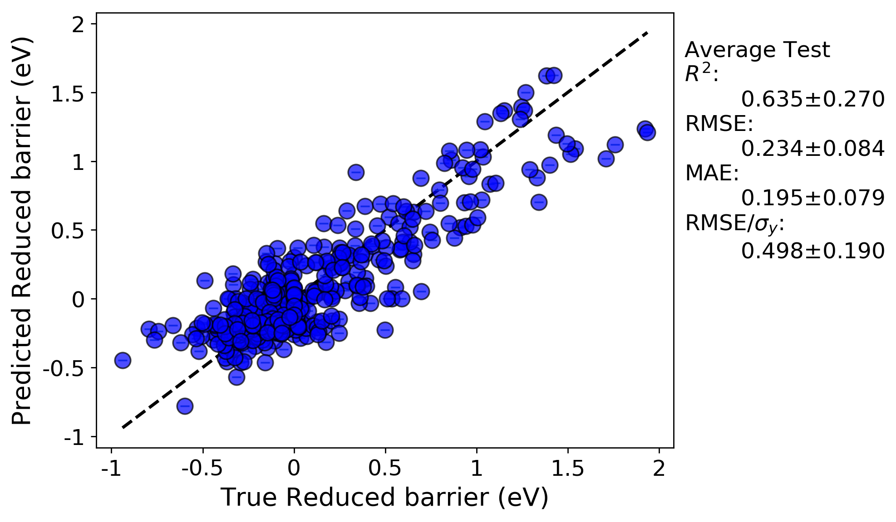

We can immediately see the R-squared and errors are both worse for the LOG cross-validation test compared to the random
cross-validation test. This is likely because the LOG test is a more rigorous test of model extrapolation, because the test
scores in each case are for data for which host elements were never included in the training set. In addition, a minor
effect contributing to the reduced accuracy may be due to the fact that the model hyperparameters were optimized by evaluating
the root mean squared error for a random cross-validation test. If instead the parameters were optimized using the LOG test,
the resulting fits would likely be improved.

There are a couple additional plots that are usual output for a LOG test that are worth drawing attention to. The first
is a plot of each metric test value for each group. This enables one to quickly assess which groups perform better or worse
than others.

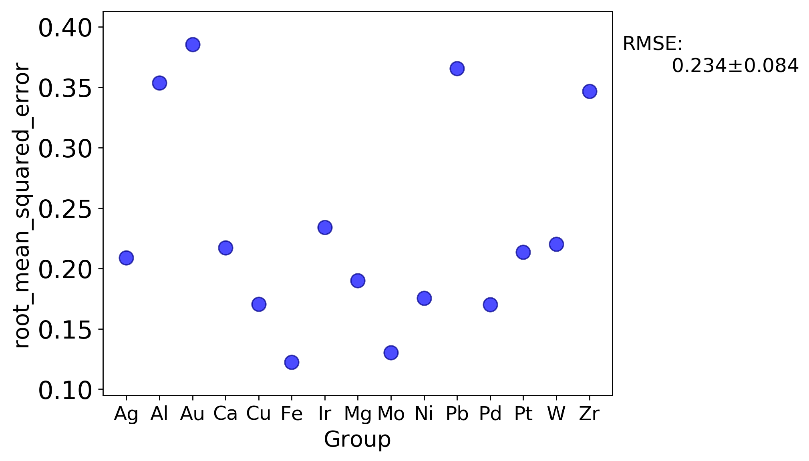

In addition, the parity plots for each split are now plotted with symbols denoting each group, which can help assess clustering
of groups and goodness of fit on a per-group basis.

Training on all groups except Ag:

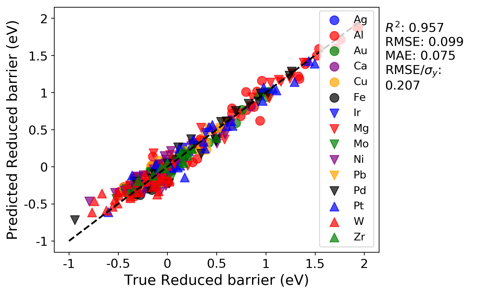

Testing on just Ag as the left-out host element:

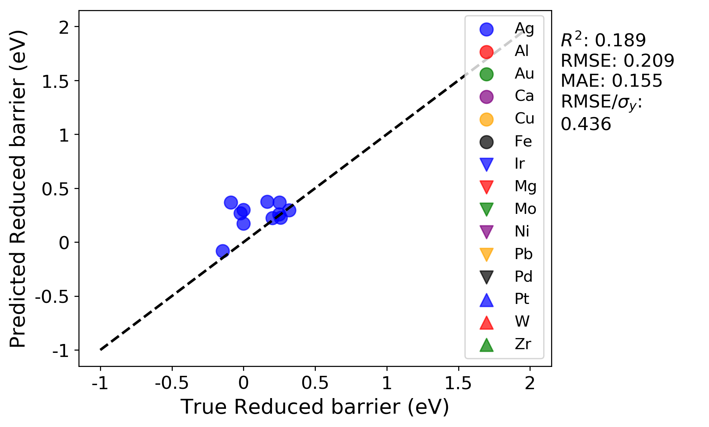

======================================================
Making predictions by importing a previously fit model
======================================================

Here, we are going to import a previously fit model, and use it to predict the migration barriers for
those data points with Pt as the host element.

In your previous run, the LOG test split where the Pt host values were predicted is in the split_12 folder. The parity
plot for Pt test data should look like the below plot for your previous run:

.. image:: MASTMLtutorial_run8_1.png

Here, we are going to import the model that was fitted to all the groups except Pt, and use MAST-ML's data validation function
as detailed above to obtain this same plot, but with using Pt as the validation data and the imported, previously trained model.
If one were to extend this data set to include, for example, U as a host element, any number of previously trained models
could be used to predict the migration barrier values for U. To import this model, save the KernelRidge_split_12.pkl file
from your previous run into the /models/ folder (it is as the the same level as the /tests/ folder in your main MAST-ML
directory). To import this model into your next run, you can create a new field in the Models section, as shown below:

Example::

    [Models]
        #[[KernelRidge]]
        #    kernel = rbf
        #    alpha = 0.034
        #    gamma = 0.138
        #[[KernelRidge_select]]
        #    kernel = rbf
        #    alpha = 1
        #    gamma = 1
        #[[KernelRidge_learn]]
        #    kernel = rbf
        #    alpha = 1
        #    gamma = 1
        [[ModelImport]]
            model_path = models/KernelRidge_split_12.pkl

As we are only interested in assessing the fit on Pt for this example, we can change the DataSplits section to only have
the LOG test:

Example::

    [DataSplits]
        #[[NoSplit]]
        [[RepeatedKFold]]
            n_splits = 5
            n_repeats = 2
        #[[RepeatedKFold_learn]]
        #    n_splits = 5
        #    n_repeats = 2
        [[LeaveOneGroupOut]]
            grouping_column = Host element

From running this model and inspecting the test data parity plot in split_12 (the folder for Pt group, we obtain this parity plot:

.. image:: MASTMLtutorial_run8_2.png

As a comparison, this plot is exactly the same as the above plot from the previous run. This is the expected result, and
demonstrates that the previously fit model was successfully imported and used to predict the Pt values. By inspecting the
other groups, for example split_1, which is for Ag, the R squared and errors indicate a better fit than our previous run.
This better fit is expected, as the model we saved from the previous run contained Ag in the training data, so these predictions
on Ag should be improved (note that this is defeats the purpose of the LOG test, but shows that the trained model we imported
is behaving as expected).

============================================
Predicting values for new, extrapolated data
============================================

As a final example, we are going to use our model to predict the migration barriers for those data points with Pt as the
host element. Your data file already has a column with the title "predict_Pt", with values equal to 0 in all rows except
where Pt is the host, in which case the value is 1. In the GeneralSetup section of your input file, add the parameter
validation_columns, and have it equal to "predict_Pt", as shown below. This will make it so that the data with Pt as the
host element will never be involved in the model training. This feature is a convenient way to isolate part of your data,
or some new part of your data, to only function as a validation data set. This way, whenever a model is trained and tested
on the remaining data, an additional prediction will also be calculated, which here is for the Pt host data.

Example::

    [GeneralSetup]
        input_features = Auto
        target_feature = Reduced barrier (eV)
        randomizer = False
        metrics = Auto
        not_input_features = Host element, Solute element, predict_Pt
        grouping_feature = Host element
        validation_columns = predict_Pt

For this test, let's run both the random cross-validation and LOG test. As a reminder, we need to un-comment the random
cross-validation test in the DataSplits section:

Example::

    [DataSplits]
        #[[NoSplit]]
        [[RepeatedKFold]]
            n_splits = 5
            n_repeats = 2
        #[[RepeatedKFold_learn]]
        #    n_splits = 5
        #    n_repeats = 2
        [[LeaveOneGroupOut]]
            grouping_column = Host element

When running this test, you'll notice there are fewer splits in the LOG test folder now. This is because Pt is only treated
as a final "validation" or "extrapolation" data set, and is never involved in the training or test set in any split. For
each split in the random and LOG CV tests, there is a "stats.txt" file which is written, which provides the average train, test
and prediction results. The prediction results are for the Pt validation data. Below are screenshots of the stats.txt file
for the random and LOG tests.

Random cross-validation:

.. image:: MASTMLtutorial_run9_1.png

LOG cross-validation:

.. image:: MASTMLtutorial_run9_2.png

For the random cross-validation, the R-squared and error values are higher for the predict_Pt dataset compared to the
average of the testing datasets. This is to be expected, as Pt is never involved in model training. Further, we can see
that the predictions for predict_Pt are slightly worse in the case of the LOG cross-validation test compared to the
random cross-validation test. This also makes sense, as each training split of the LOG test tends to result in worse
predictive performance (i.e. worse model training), relative to the random cross-validation case, as discussed in the
above test when we compared the results of the random and LOG cross-validation tests.

This concludes the MAST-ML tutorial document! There are some other features of MAST-ML which were not explicitly discussed
in this tutorial, such as forming data clusters. Consult the MAST-ML Input File section of this documentation for a more
in-depth overview of all the possible options for different MAST-ML runs.