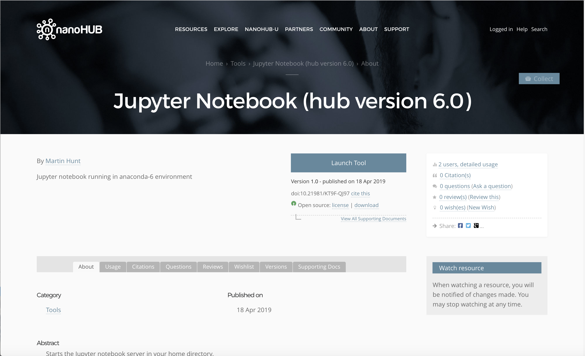
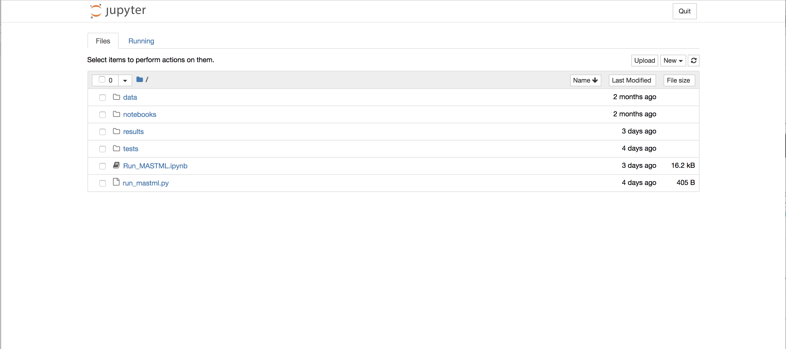

******************************************************************
Running MAST-ML on Nanohub
******************************************************************

In addition to running MAST-ML on your own machine or computing cluster, a version of MAST-ML
is publicly available for use on Nanohub. This can be advantageous as MASTML comes pre-installed in a public
Python environment, so you don't have to worry about installing it yourself.

You can sign up for a Nanohub account at https://nanohub.org

Once you have a Nanohub account and sign in, your home screen will look something like this:

.. image:: NanohubHome.png

You'll want to start a Jupyter Notebook, which can be found on the right-hand side under "My Tools"
(note if it is not listed, you can search for it under "All Tools").

Once you click on the Jupyter Notebook tool, you'll see a screen like below. Launch the tool by clicking "Launch Tool".

After the Jupyter Notebook tool starts (this may take a minute), you'll see the Jupyter Notebook home directory,
which will look something like below:

You'll see in the image above there are two files: Run_MASTML.ipynb and run_mastml.py. These are a Jupyter notebook
and python script used to run MASTML, respectively. Your home directory won't come with them pre-installed, but they are
contained on the MASTML repository on Github and can also be downloaded via the links below:

:download:`Run_MASTML.ipynb <Run_MASTML.ipynb>`

:download:`run_mastml.py <run_mastml.py>`

Once you have these files (either will do), you can easily upload them to the Nanohub Jupyter Notebook environment using
the "Upload" button shown above in the Jupyter Notebook home directory screenshot.

The last thing to do before we can run MASTML is to also upload a MASTML input file and data file to Nanohub. If you
don't have your own, you can download and use the files below as an example. Note that you will have to update the path
specifying the location of the data file and input file in the .ipynb or .py file use to run MASTML, if you create a path
which differs from the default path of '/tests/conf/' and '/tests/csv/'.

:download:`example_input.conf <example_input.conf>`

:download:`example_data.csv <example_data.csv>`

Shown below is the Run_MASTML.ipynb notebook file. The first block imports MASTML, and doesn't need to be changed.
The second block specifies the path to find the conf file ("conf" line) and the data file ("csv" line). The "output"
line provides a path to save the output from your MASTML run. You'll have to update the "conf" and "csv" lines if you
change those paths or the file names. The third block executes the MASTML run. Below it, you'll see the MASTML log print
to the screen as it runs (this information is also saved to a .log file).

.. image:: RunMASTML.png

Finally, the output of your MASTML run can be rather large, with many folders and files contained in each folder. To
download this information, you need to first zip the file before it can be downloaded from Nanohub. This can be done by
opening the Terminal via New -> Terminal. Navigate to the results folder, e.g with "cd results/". Then, zip the folder
with the Terminal command "tar -zcvf myresults.tar.gz myresults", where "myresults" is the folder name of the results
folder you wish to download. Once everything is zipped up, you can can click on the zipped folder and download it directly.
